# Perceptron Neural Networks

## Overview

The perceptron is one of the foundational algorithms in machine learning and neural networks. Created by Frank Rosenblatt, it is a simple yet powerful linear classifier capable of learning from training data. Perceptrons are especially suited for binary classification problems and serve as the building block for understanding more complex neural network architectures.

## Table of Contents

1. [Neuron Model](#neuron-model)
2. [Perceptron Architecture](#perceptron-architecture)
3. [Hard-Limit Activation Function](#hard-limit-activation-function)
4. [Decision Boundaries](#decision-boundaries)
5. [Perceptron Learning Rule](#perceptron-learning-rule)
6. [Training Algorithm](#training-algorithm)
7. [Convergence Properties](#convergence-properties)
8. [Limitations and Cautions](#limitations-and-cautions)
9. [Multi-class Perceptrons](#multi-class-perceptrons)

---

## Neuron Model

The perceptron neuron is the fundamental processing unit of a perceptron network. Each neuron computes a weighted sum of its inputs, adds a bias term, and applies a hard-limit activation function to produce a binary output.

### Single Perceptron Neuron

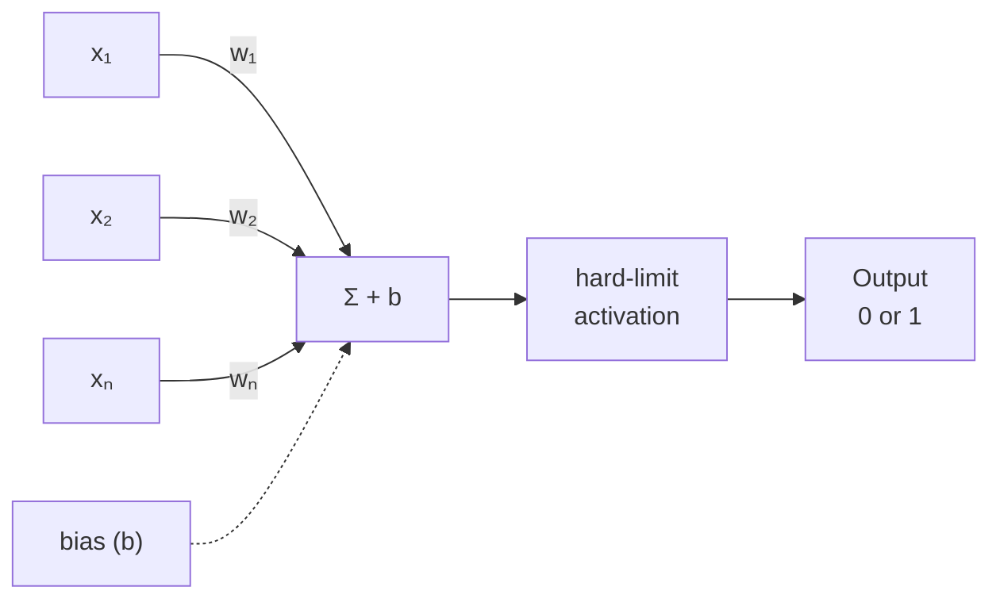

### Mathematical Formulation

For a perceptron neuron with $n$ inputs, the computation is:

$$\text{net} = \mathbf{w}^T \mathbf{x} + b = \sum_{i=1}^{n} w_i x_i + b$$

where:

- $\mathbf{x} = [x_1, x_2, \ldots, x_n]^T$ is the input vector (column vector)
- $\mathbf{w} = [w_1, w_2, \ldots, w_n]^T$ is the weight vector (column vector)
- $b$ is the bias term
- $\text{net}$ is the net input (weighted sum plus bias)

The output is computed by applying the hard-limit (step) activation function:

$$a = \text{hardlim}(\text{net}) = \begin{cases} 1 & \text{if } \text{net} \geq 0 \\ 0 & \text{if } \text{net} < 0 \end{cases}$$

---

## Perceptron Architecture

A perceptron network consists of a single layer of $S$ perceptron neurons, each connected to $R$ inputs through weighted connections.

### Single-Layer Perceptron Network

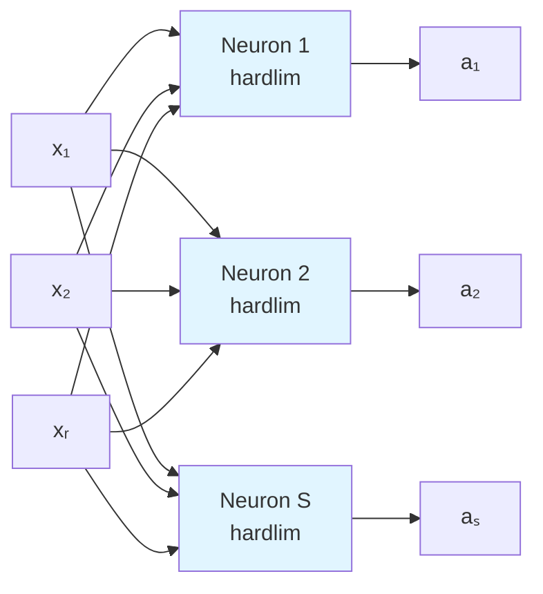

### Architecture Summary

- **Input Layer**: $R$ inputs
- **Processing Layer**: $S$ neurons, each with:
  - Weight vector $\mathbf{w}_{i} \in \mathbb{R}^R$ (one weight per input)
  - Bias term $b_i$
  - Hard-limit activation function
- **Output Layer**: $S$ binary outputs

The complete network transformation can be expressed as:

$$\mathbf{a} = \text{hardlim}(\mathbf{W}\mathbf{x} + \mathbf{b})$$

where $\mathbf{W}$ is an $S \times R$ weight matrix and $\mathbf{b}$ is an $S \times 1$ bias vector.

---

## Hard-Limit Activation Function

The hard-limit transfer function is what makes a perceptron unique. It enables binary classification by producing only two possible outputs: 0 or 1.

### Function Definition

$$\text{hardlim}(\text{net}) = \begin{cases} 1 & \text{if } \text{net} \geq 0 \\ 0 & \text{if } \text{net} < 0 \end{cases}$$

### Visualization

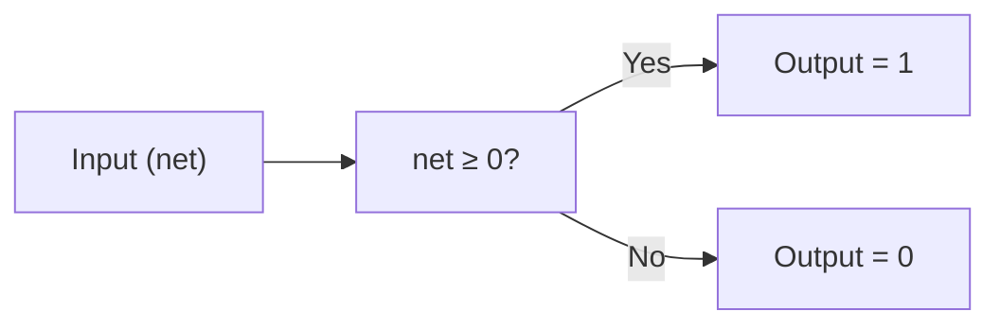

### Step Function Plot

The hard-limit function is a step function that transitions from 0 to 1 at the threshold $n = 0$:

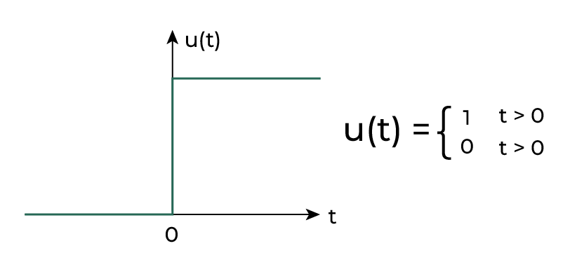
*<br>Figure: step function plot*

### Key Characteristics

- **Discontinuous**: Non-differentiable at $n = 0$
- **Binary Output**: Only outputs 0 or 1
- **Threshold-based**: Decision boundary at net input = 0
- **Simple Interpretation**: Direct binary classification

---

## Decision Boundaries

One of the most important properties of perceptrons is their ability to create decision boundaries that divide the input space into regions.

### Two-Input Perceptron Decision Boundary

For a two-input perceptron with weights $w_1 = -1$, $w_2 = 1$, and bias $b = 1$:

The decision boundary is defined by: $W\mathbf{p} + b = 0$

$$-1 \cdot x_1 + 1 \cdot x_2 + 1 = 0$$
$$x_2 = x_1 - 1$$

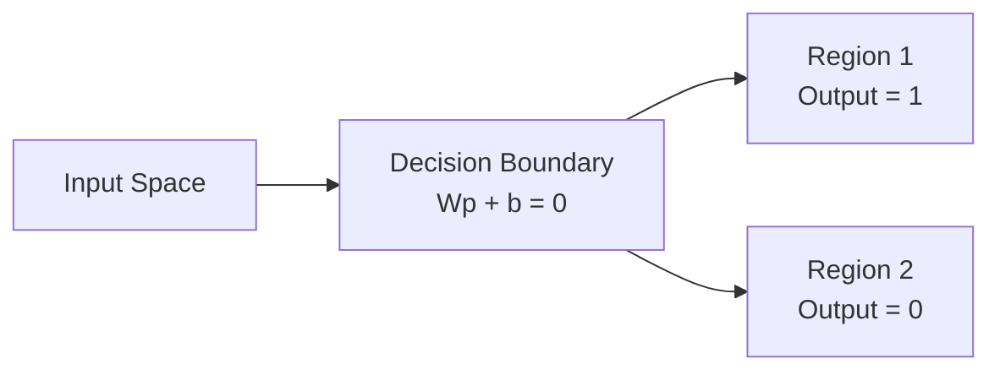

### Geometric Interpretation

- **Above the boundary**: Output = 1
- **Below the boundary**: Output = 0
- **Line perpendicular to weights**: The boundary is always perpendicular to the weight vector $\mathbf{W}$
- **Bias effect**: The bias shifts the boundary away from the origin

### Linear Separability

Perceptrons can only solve **linearly separable** problems—problems where input vectors can be separated by a single straight line (in 2D) or hyperplane (in higher dimensions).

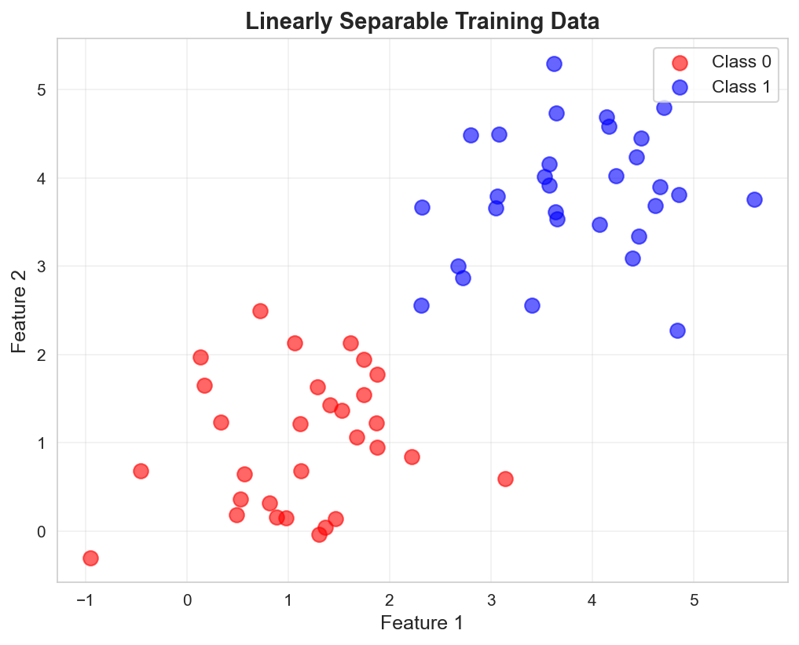
*Figure: Linearly separable binary classification data. The two classes cluster around (1,1) and (4,4) with a clear decision boundary.*

```bash
    Linearly Separable        NOT Linearly Separable
    (Perceptron works)        (Perceptron fails)
    
    x    o                     x    o
    x    o                     o    x
    x    o    ___line___       x o x o
```

---

## Perceptron Learning Rule

The perceptron learning rule is the algorithm used to train perceptrons. It updates weights and biases based on classification errors to gradually improve performance.

### The Learning Rule

Given a training example $(\mathbf{x}, t)$ where:

- $\mathbf{x}$ is the input vector (column vector)
- $t$ is the target (correct) output (0 or 1)
- $a$ is the actual network output
- $e = t - a$ is the error

The weight update rule is:

$$\Delta \mathbf{w} = e \mathbf{x} = (t - a)\mathbf{x}$$

And the bias update rule is:

$$\Delta b = e = (t - a)$$

The new weights and biases are:

$$\mathbf{w}_{\text{new}} = \mathbf{w}_{\text{old}} + \Delta \mathbf{w}$$
$$b_{\text{new}} = b_{\text{old}} + \Delta b$$

### Three Cases

The perceptron learning rule handles three scenarios:

| Case | Condition | Action | Meaning |
|------|-----------|--------|---------|
| **1** | $a = t$ (correct) | $\Delta \mathbf{w} = 0$, $\Delta b = 0$ | No change needed |
| **2** | $a = 0, t = 1$ (false negative) | Add $\mathbf{x}$ to $\mathbf{w}$ | Move decision boundary toward input |
| **3** | $a = 1, t = 0$ (false positive) | Subtract $\mathbf{x}$ from $\mathbf{w}$ | Move decision boundary away from input |

### Intuition

The learning rule geometrically adjusts the weight vector:

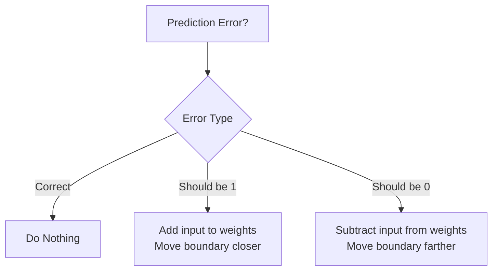

---

## Training Algorithm

The perceptron is trained using an iterative algorithm that repeatedly presents training examples and updates the weights based on errors.

### Training Process

```bash
Initialize w = 0, b = 0

REPEAT for multiple epochs:
  FOR each training example (x, t):
    1. Compute net input: net = w^T x + b
    2. Compute output: a = hardlim(net)
    3. Compute error: e = t - a
    4. Update weights: w_new = w_old + e*x
    5. Update bias: b_new = b_old + e
  END FOR
UNTIL convergence or max epochs reached
```

### Training Example (Hand Calculation)

Consider a simple problem with 2-input, 1-output perceptron:

**Training Data:**

- $(\mathbf{x}_1, t_1) = ([2, 2]^T, 0)$
- $(\mathbf{x}_2, t_2) = ([1, -2]^T, 1)$
- $(\mathbf{x}_3, t_3) = ([-2, 2]^T, 0)$
- $(\mathbf{x}_4, t_4) = ([-1, 1]^T, 1)$

**Epoch 1, Step 1:** Process $\mathbf{x}_1 = [2, 2]^T$, target $t_1 = 0$

Initial: $\mathbf{w} = [0, 0]^T$, $b = 0$

1. Net input: $\text{net} = \mathbf{w}^T \mathbf{x}_1 + b = [0, 0][2, 2]^T + 0 = 0$
2. Output: $a = \text{hardlim}(0) = 1$
3. Error: $e = 0 - 1 = -1$
4. Weight update: $\Delta \mathbf{w} = e \cdot \mathbf{x}_1 = -1 \cdot [2, 2]^T = [-2, -2]^T$
5. New weights: $\mathbf{w} = [0, 0]^T + [-2, -2]^T = [-2, -2]^T$
6. Bias update: $\Delta b = e = -1$
7. New bias: $b = 0 + (-1) = -1$

**Epoch 1, Step 2:** Process $\mathbf{x}_2 = [1, -2]^T$, target $t_2 = 1$

1. Net input: $\text{net} = \mathbf{w}^T \mathbf{x}_2 + b = [-2, -2][1, -2]^T + (-1) = -2 + 4 - 1 = 1$
2. Output: $a = \text{hardlim}(1) = 1$ ✓ Correct!
3. Error: $e = 1 - 1 = 0$ (no update needed)

The process continues until all training examples are correctly classified.

### Training Visualization

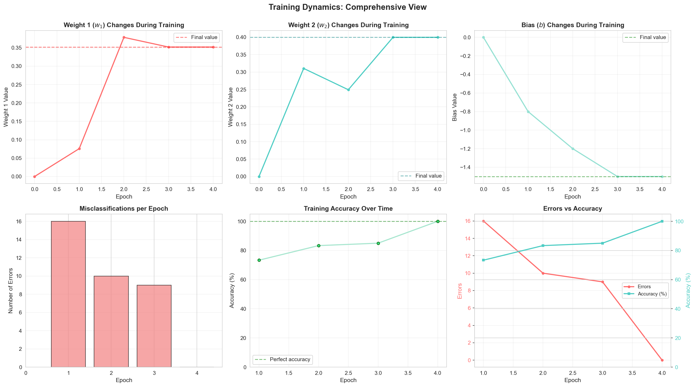
*Figure: Six comprehensive visualizations showing how weights, bias, errors, and accuracy evolve during training. The 2×3 grid displays weight 1, weight 2, bias changes, misclassifications per epoch, accuracy progression, and combined error/accuracy view.*

---

## Convergence Properties

### Perceptron Convergence Theorem

**The Perceptron Convergence Theorem** states:

> If the training data is **linearly separable**, the perceptron learning algorithm will converge to a solution in a **finite number of iterations**, regardless of initial weights.

### Key Conditions for Convergence

1. **Data Linear Separability**: Training examples must be separable by a hyperplane
2. **Learning Procedure**: Use the standard perceptron learning rule (online/adaptive learning)
3. **Fixed Learning Rate**: A constant learning rate works if data is separable

### Convergence Guarantee

- ✓ **Guaranteed**: For linearly separable data with adaptive/online training
- ✗ **Not Guaranteed**: For non-linearly separable data
- ⚠️ **Conditional**: For batch training (accumulating errors over a full pass)

### Decision Boundary Evolution

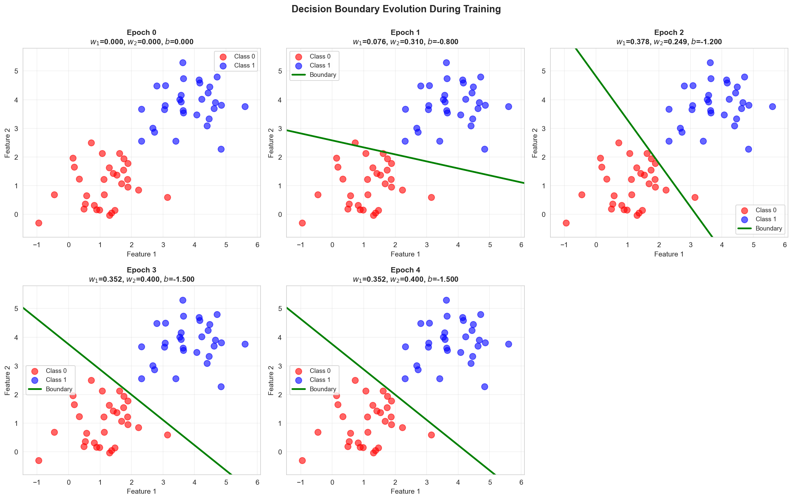
*Figure: How the decision boundary changes over six selected epochs during training. Each subplot shows the current boundary position (green line) relative to the training data (red/blue points). The boundary adjusts iteratively to separate the two classes.*

### Non-Separable Data Solutions

If data is **not linearly separable**, convergence can be forced by:

1. **Decreasing Learning Rate**: As training progresses, reduce the learning rate $\alpha$
   $$\alpha(t) = \frac{1000}{1000 + t}$$
   where $t$ is the iteration number

2. **Adaptive Learning Rate**: Proportional to $\frac{1}{t}$ or similar decay schedules

3. **Accept Suboptimal Solution**: Stop after maximum iterations with best found solution

### Final Decision Boundary

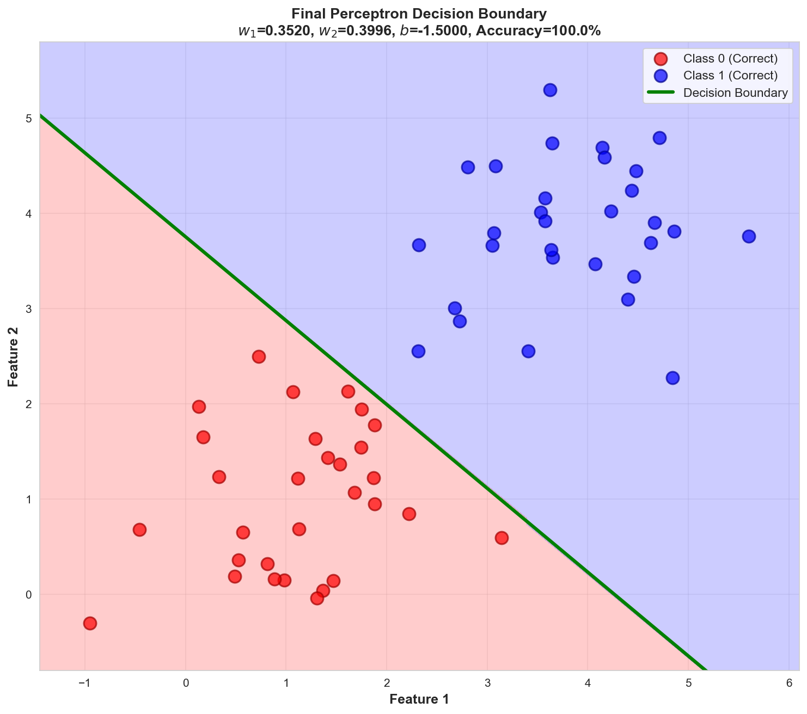
*Figure: The learned decision boundary after convergence, with shaded regions showing the classification regions. Red regions predict Class 0, blue regions predict Class 1. All training points are correctly classified (100% accuracy).*

---

## Limitations and Cautions

Despite their elegance and theoretical guarantees, perceptrons have significant practical limitations.

### Fundamental Limitation 1: Linear Separability Only

Perceptrons **cannot solve non-linearly separable problems**.

**Example: XOR Problem**

The XOR (exclusive OR) function is not linearly separable:

| $x_1$ | $x_2$ | XOR |
|-------|-------|-----|
| 0 | 0 | 0 |
| 0 | 1 | 1 |
| 1 | 0 | 1 |
| 1 | 1 | 0 |

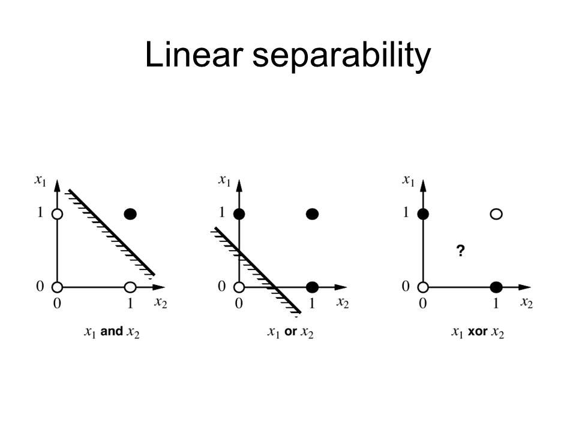
*<br>Figure: XOR problem visualization.*

No single line can separate the 1s from the 0s.

### Fundamental Limitation 2: Binary Output Only

The hard-limit function restricts output to {0, 1}, limiting applications.

### Practical Limitation 1: Outliers

Large outlier input vectors can dramatically slow convergence.

**Problem**: When an input $\mathbf{x}$ with large magnitude is misclassified:
$$\Delta \mathbf{w} = e \mathbf{x} \quad \text{(large change if } \|\mathbf{x}\| \text{ is large)}$$

Smaller inputs require many iterations to overcome this change.

**Solution: Normalized Perceptron Rule**

Instead of:
$$\Delta \mathbf{w} = e \mathbf{x}$$

Use:
$$\Delta \mathbf{w} = \frac{e \mathbf{x}}{\|\mathbf{x}\|}$$

This normalizes the update magnitude, making training insensitive to input vector scales.

### Practical Limitation 2: Decision Boundary Instability

When data is not linearly separable, perceptrons can **thrash** between different boundary positions, never converging.

**Solutions**:

- Reduce learning rate gradually
- Use momentum or other regularization
- Consider alternative algorithms (SVM, logistic regression)

### Practical Limitation 3: Optimal Boundary Uncertainty

When a gap exists between classes, the perceptron doesn't know where to place the boundary.

**Alternative Approach: Support Vector Machines (SVM)**

- Maximizes the **margin** (distance between boundary and nearest data points)
- Provides a principled solution for boundary placement

---

## Multi-class Perceptrons

Perceptrons extend naturally to multi-class classification using multiple parallel units.

### Multi-class Architecture

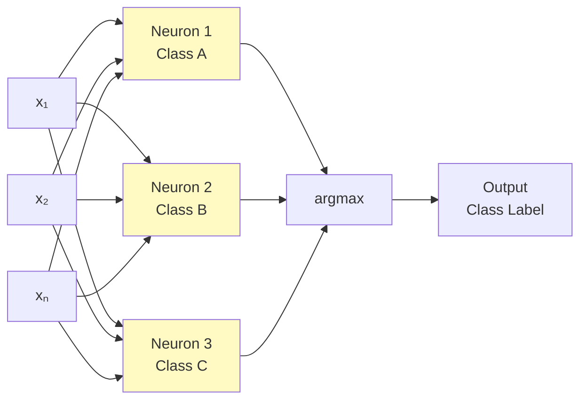

### Multi-class Update Rule

For a training example $(x, y)$ where:

- $y$ is the correct class label
- $y'$ is the predicted class (argmax of outputs)

**Update Rule:**

- For weights of class $y$ (correct class):
$$w_i^{(y)} = w_i^{(y)} + \alpha x_i$$

- For weights of class $y'$ (predicted class, if wrong):
$$w_i^{(y')} = w_i^{(y')} - \alpha x_i$$

- For all other classes: no update

### Classification Regions

Multi-class perceptrons create **piecewise linear decision boundaries**:

- Each pair of classes separated by a linear boundary
- Overall regions form a Voronoi-like partition

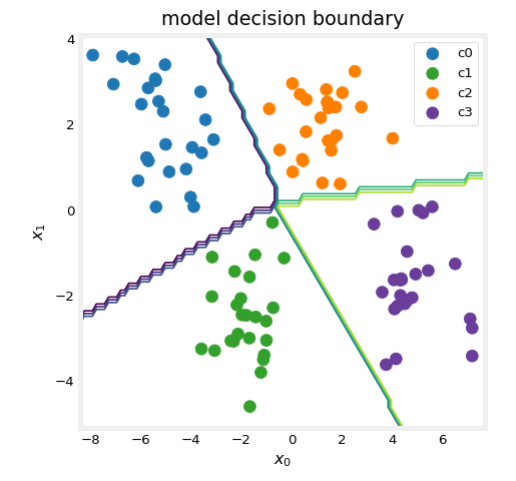
*<br>Figure: Piecewise linear decision boundaries created by multi-class perceptrons.*

---

## Summary

The perceptron is a foundational neural network architecture with several key characteristics:

| Aspect | Details |
|--------|---------|
| **Type** | Single-layer, feedforward classifier |
| **Activation** | Hard-limit (step) function → binary output |
| **Input** | $R$-dimensional feature vectors |
| **Output** | Binary (0 or 1) or multi-class |
| **Learning** | Perceptron learning rule (online/adaptive) |
| **Convergence** | Guaranteed for linearly separable data |
| **Decision Boundary** | Linear (hyperplane) |
| **Strengths** | Simple, fast, theoretically sound, interpretable |
| **Limitations** | Only linear separation, limited to linearly separable problems |

### When to Use Perceptrons

✓ **Good for:**

- Binary classification with linearly separable data
- Educational purposes (understanding neural networks)
- Baseline classifier for comparison
- Real-time applications (low computational cost)

✗ **Not suitable for:**

- Complex non-linear classification
- Multi-layer feature learning
- Overlapping class distributions
- Unbalanced class problems

### Extensions and Related Algorithms

- **Multi-layer Networks**: MLPs with hidden layers can solve non-linear problems
- **Logistic Regression**: Uses sigmoid activation instead of hard-limit
- **Support Vector Machines (SVM)**: Finds optimal separating hyperplane
- **Deep Learning**: Modern extension of perceptron concepts
